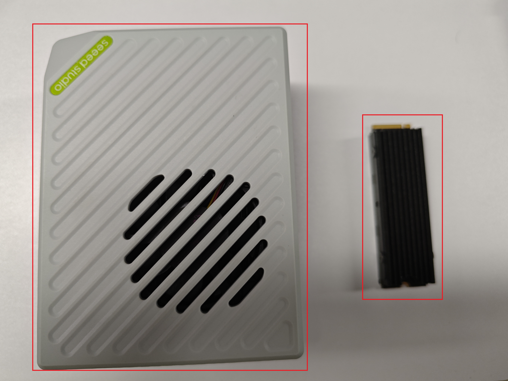
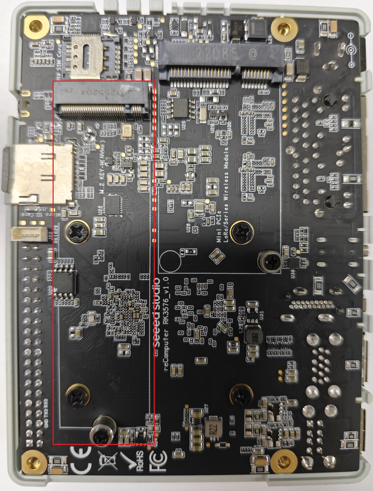
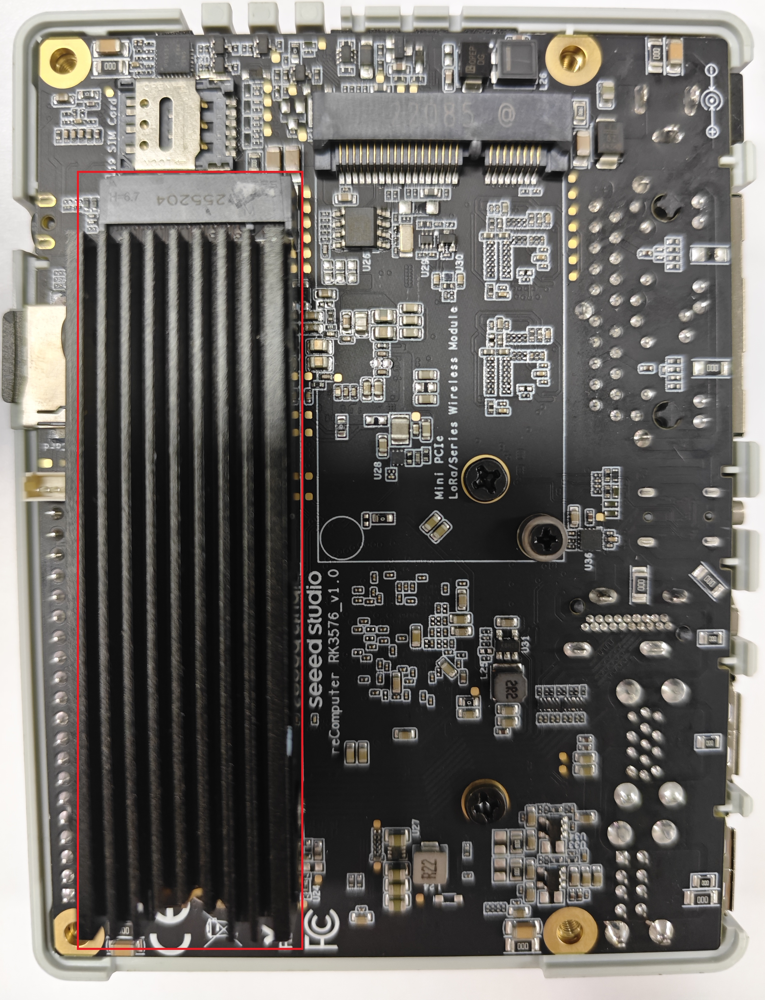
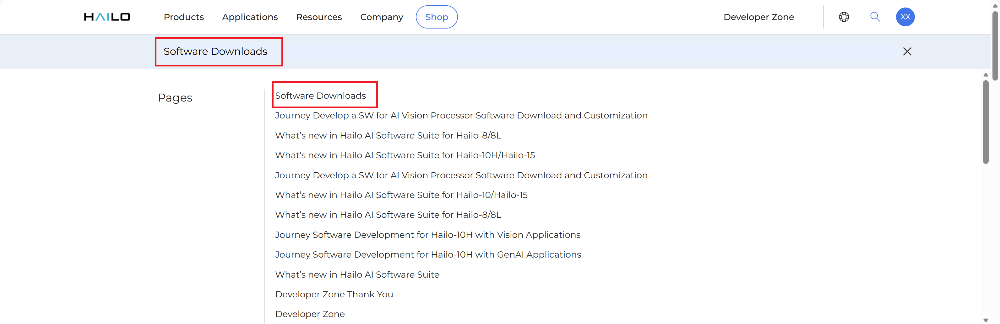
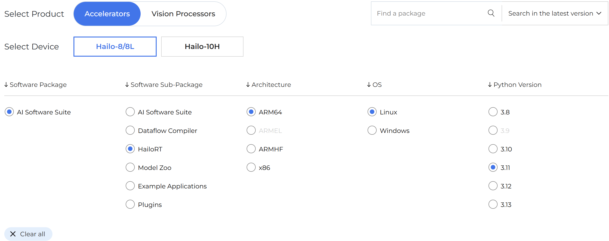
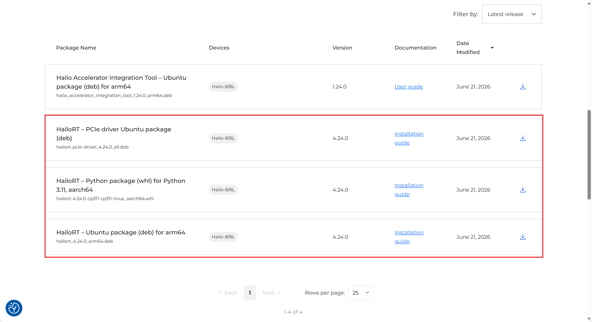
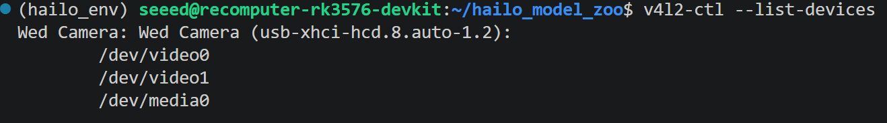
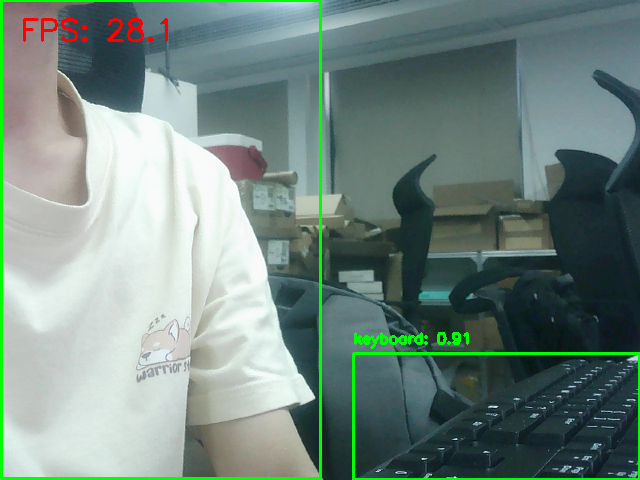
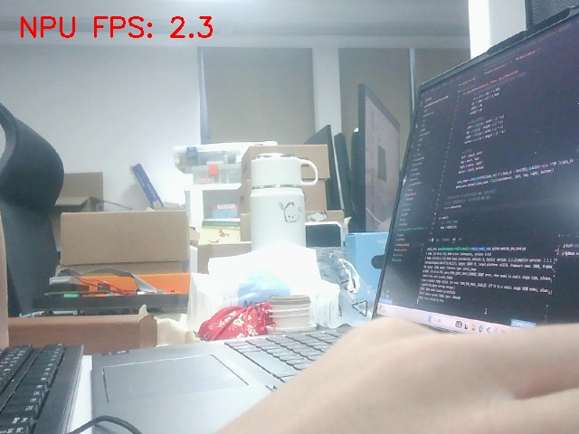

# reComputer-RK3576-Hailo-8-AI
reComputer RK3576 + Hailo-8：AI加速卡测评
# 概述
reComputer RK3576 是一款基于瑞芯微 RK3576 处理器的边缘 AI 计算设备，内置 6 TOPS NPU。通过 M.2 接口集成 Hailo-8 AI 加速模块后，总 AI 算力可扩展至 26 TOPS。

本指南将带你通过 Seeed Studio 的 reComputer AI Lab 平台，在 reComputer RK3576 + Hailo-8 组合上一站式部署主流开源 AI 模型，包括：
* 目标检测（YOLO11）
* 大模型对话（DeepSeek-R1）
* 视觉对话（Qwen2.5-VL）

全部模型在本地设备运行即可

## 性能概述

| 指标                          | 数据              |
| ----------------------------- | ----------------- |
| 目标检测延迟（RK3576）        | ~30ms/帧<sup> |
| Hailo-8 算力                  | 26 TOPS<sup>  |
| YOLO11n 推理性能              | 200+ FPS<sup> |

# 硬件准备
你需要准备以下硬件：
* reComputer RK3576-20 主机 × 1
* Hailo-8 M.2 2280 AI 加速模块 × 1
* 9-19V/3A DC × 1
* 显示器、键盘鼠标 × 1

## Hailo-8 安装步骤 
reComputer RK3576 和 Hailo-8 示意图如下图所示，其中左边为 reComputer RK3576，右边为 Hailo-8。


具体安装步骤为：
- **步骤1.** 断开电源，打开 reComputer RK3576 外壳，图中红色框框就是 RK3576 的 M.2 M-Key 接口。

- **步骤2.** 将 Hailo-8 模块插入主板的 M.2 M-Key 接口

- **步骤3.** 固定螺丝，重新组装外壳。
- **步骤4.** 连接电源、网线和必要外设，启动设备。

# reComputer RK3576 + Hailo-8 软件包部署指南

- **步骤1.** 进入hailo官网，在搜索栏搜索Software Downloads

- **步骤2.** 选择对应的硬件，这里选择Hailo-8

- **步骤3.** 具体文件下载


### Windows PowerShell 上传deb包到RK3576
在Windows终端(PowerShell/Windows Terminal)执行：

```powershell
scp C:\Users\seeed\Downloads\hailort-pcie-driver_4.24.0_all.deb seeed@192.168.10.230:/home/seeed/
scp C:\Users\seeed\Downloads\hailort-4.24.0-cp311-cp311-linux_aarch64.whl seeed@192.168.10.230:/home/seeed/
scp C:\Users\seeed\Downloads\librknnrt.so seeed@192.168.10.230:/home/seeed/
```

然后在RK3576终端执行：

```bash
# Install the PCIe driver
sudo dpkg -i hailort-pcie-driver_4.24.0_all.deb

# Reboot the system
sudo reboot

# After reboot, verify the driver is loaded
lsmod | grep hailo

# Install HailoRT
sudo dpkg -i hailort_4.24.0_arm64.deb

# Scan and verify device status
hailortcli scan

# Create and activate a virtual environment
python3 -m venv hailo_env
source hailo_env/bin/activate

# Install HailoRT Python library
pip install hailort-4.23.0-cp311-cp311-linux_aarch64.whl

# Verify installation and device connection
python3 -c "from hailo_platform import VDevice; vdev = VDevice(); print('Successfully connected via VDevice! Device info:', vdev)"
```
然后安装官方 Hailo Model Zoo 工具库，用来下载、转换、运行适配 Hailo PCIe 加速卡的预训练 AI 模型（目标检测、分类等）
```bash
# 1. Install required system libraries
sudo apt update
sudo apt install -y git libglib2.0-0 libgl1-mesa-glx

# 2. Clone the official repository (latest branch recommended)
git clone https://github.com/hailo-ai/hailo_model_zoo.git
cd hailo_model_zoo
pip install -e .
```
检测摄像头是否存在
```bash
v4l2-ctl --list-devices
```


# 在Hailo-8加速卡运行YOLO11n模型
下载 yolov11n.hef 完整命令（在 hailo_model_zoo 目录、激活虚拟环境后执行）
```bash
hailomz compile yolov11n
```

创建python文件，文件名称：webcam_yolo11n，最后代码如下：
```python
import numpy as np
import cv2
import time
from hailo_platform import (VDevice, HEF, InferVStreams, ConfigureParams,
                            HailoStreamInterface, InputVStreamParams, OutputVStreamParams)

# ================= Configuration =================
HEF_PATH = 'yolov11n.hef'
DEVICE_ID = "/dev/video0"  # Update based on v4l2-ctl output
CONF_THRESHOLD = 0.45

# COCO Dataset 80 Class Labels
COCO_CLASSES = [
    "person", "bicycle", "car", "motorcycle", "airplane", "bus", "train", "truck", "boat", "traffic light",
    "fire hydrant", "stop sign", "parking meter", "bench", "bird", "cat", "dog", "horse", "sheep", "cow",
    "elephant", "bear", "zebra", "giraffe", "backpack", "umbrella", "handbag", "tie", "suitcase", "frisbee",
    "skis", "snowboard", "sports ball", "kite", "baseball bat", "baseball glove", "skateboard", "surfboard",
    "tennis racket", "bottle", "wine glass", "cup", "fork", "knife", "spoon", "bowl", "banana", "apple",
    "sandwich", "orange", "broccoli", "carrot", "hot dog", "pizza", "donut", "cake", "chair", "couch",
    "potted plant", "bed", "dining table", "toilet", "tv", "laptop", "mouse", "remote", "keyboard", "cell phone",
    "microwave", "oven", "toaster", "sink", "refrigerator", "book", "clock", "vase", "scissors", "teddy bear",
    "hair drier", "toothbrush"
]
# ==================================================

def main():
    # 1. Initialize Hailo Hardware
    hef = HEF(HEF_PATH)
    input_vstream_info = hef.get_input_vstream_infos()[0]
    input_h, input_w = input_vstream_info.shape[:2]

    cap = cv2.VideoCapture(DEVICE_ID)
    if not cap.isOpened():
        print("Cannot open webcam")
        return

    # Setup inference variables
    prev_time = 0

    with VDevice() as target:
        config_params_dict = ConfigureParams.create_from_hef(hef, HailoStreamInterface.PCIe)
        network_group = target.configure(hef, config_params_dict)[0]
        with network_group.activate():
            vstream_params = (InputVStreamParams.make_from_network_group(network_group),
                              OutputVStreamParams.make_from_network_group(network_group))
            with InferVStreams(network_group, vstream_params[0], vstream_params[1]) as vstreams:
                print("[INFO] Initialization successful! Running YOLOv11n real-time detection...")
                while True:
                    start_time = time.time()  # Record start time for FPS
                    ret, frame = cap.read()
                    if not ret:
                        break

                    # Preprocessing (Convert to RGB based on previous validation)
                    frame_rgb = cv2.cvtColor(frame, cv2.COLOR_BGR2RGB)
                    resized = cv2.resize(frame_rgb, (input_w, input_h))
                    input_tensor = np.expand_dims(resized, axis=0)

                    # Inference
                    outputs = vstreams.infer(input_tensor)

                    # Parsing and Drawing
                    h, w, _ = frame.shape
                    for name, class_list in outputs.items():
                        # Iterate through 80 classes
                        for class_id, detections in enumerate(class_list[0]):
                            if len(detections) > 0:
                                for det in detections:
                                    if len(det) >= 5:
                                        ymin, xmin, ymax, xmax, confidence = det[:5]
                                        if confidence > CONF_THRESHOLD:
                                            # Coordinate Mapping
                                            left, top = int(xmin * w), int(ymin * h)
                                            right, bottom = int(xmax * w), int(ymax * h)

                                            # Get class name, display ID if out of bounds
                                            class_name = COCO_CLASSES[class_id] if class_id < len(COCO_CLASSES) else f"ID {class_id}"

                                            # Draw bounding box
                                            cv2.rectangle(frame, (left, top), (right, bottom), (0, 255, 0), 2)
                                            # Draw background and label text
                                            label = f"{class_name}: {confidence:.2f}"
                                            cv2.putText(frame, label, (left, top - 10),
                                                        cv2.FONT_HERSHEY_SIMPLEX, 0.5, (0, 255, 0), 2)

                    # Calculate and display real-time FPS
                    curr_time = time.time()
                    fps = 1 / (curr_time - start_time)
                    # Print in the top left corner
                    cv2.putText(frame, f"FPS: {fps:.1f}", (20, 40),
                                cv2.FONT_HERSHEY_SIMPLEX, 1, (0, 0, 255), 2)

                    # Display window
                    cv2.imshow('reComputer RK3576 - Hailo YOLOv11n', frame)
                    if cv2.waitKey(1) & 0xFF == ord('q'):
                        break

    cap.release()
    cv2.destroyAllWindows()

if __name__ == "__main__":
    main()
```
运行结果：

然后再创建一个python文件webcam_npu_save，让模型在RK3576在身的NPU上运行，代码如下：
```python
import numpy as np
import cv2
import time
import os
from rknnlite.api import RKNNLite

# ================= Configuration =================
RKNN_MODEL_PATH = 'yolo11n.rknn'  # RKNN 模型路径
DEVICE_ID = 0  # 摄像头设备号，对应 /dev/video0
CONF_THRESHOLD = 0.45
OUTPUT_DIR = "npu_detection_results"
os.makedirs(OUTPUT_DIR, exist_ok=True)

# COCO Dataset 80 Class Labels
COCO_CLASSES = [
    "person", "bicycle", "car", "motorcycle", "airplane", "bus", "train", "truck", "boat", "traffic light",
    "fire hydrant", "stop sign", "parking meter", "bench", "bird", "cat", "dog", "horse", "sheep", "cow",
    "elephant", "bear", "zebra", "giraffe", "backpack", "umbrella", "handbag", "tie", "suitcase", "frisbee",
    "skis", "snowboard", "sports ball", "kite", "baseball bat", "baseball glove", "skateboard", "surfboard",
    "tennis racket", "bottle", "wine glass", "cup", "fork", "knife", "spoon", "bowl", "banana", "apple",
    "sandwich", "orange", "broccoli", "carrot", "hot dog", "pizza", "donut", "cake", "chair", "couch",
    "potted plant", "bed", "dining table", "toilet", "tv", "laptop", "mouse", "remote", "keyboard", "cell phone",
    "microwave", "oven", "toaster", "sink", "refrigerator", "book", "clock", "vase", "scissors", "teddy bear",
    "hair drier", "toothbrush"
]
# ==================================================

def post_process(outputs, frame, conf_threshold):
    """解码 YOLOv8 风格的原始输出（解耦头）"""
    h, w = frame.shape[:2]
    detections = []
    
    # 定义三个尺度的特征图尺寸
    scales = [(80, 80), (40, 40), (20, 20)]
    
    # 提取输出 (索引对应关系)
    # 0,3,6: 回归 (reg) -> [64, 80, 80] 等
    # 1,4,7: 分类 (cls) -> [80, 80, 80] 等
    # 2,5,8: 目标性 (obj) -> [1, 80, 80] 等
    reg_outputs = [outputs[0], outputs[3], outputs[6]]
    cls_outputs = [outputs[1], outputs[4], outputs[7]]
    obj_outputs = [outputs[2], outputs[5], outputs[8]]

    # 遍历三个尺度
    for reg, cls, obj, (h_feat, w_feat) in zip(reg_outputs, cls_outputs, obj_outputs, scales):
        # 将张量展平并调整维度顺序
        reg = reg.squeeze(0).transpose(1, 2, 0).reshape(-1, 64)  # [num_boxes, 64]
        cls = cls.squeeze(0).transpose(1, 2, 0).reshape(-1, 80)  # [num_boxes, 80]
        obj = obj.squeeze(0).transpose(1, 2, 0).reshape(-1, 1)   # [num_boxes, 1]

        # 对每个特征点进行解码
        for i in range(reg.shape[0]):
            # 1. 目标性分数
            obj_conf = obj[i][0]
            if obj_conf < conf_threshold:
                continue
            
            # 2. 分类分数
            cls_scores = cls[i] * obj_conf  # 分类分数 * 目标性分数
            class_id = np.argmax(cls_scores)
            confidence = cls_scores[class_id]
            if confidence < conf_threshold:
                continue

            # 3. 解码边界框 (YOLO 格式)
            # 获取特征图中的网格坐标
            row = i // w_feat
            col = i % w_feat
            
            # 从回归头中提取 x, y, w, h 的偏移量
            reg_vals = reg[i]
            dx, dy, dw, dh = reg_vals[0], reg_vals[1], reg_vals[2], reg_vals[3]
            
            # 计算中心点坐标和宽高 (在特征图上的归一化坐标)
            cx = (col + dx) / w_feat
            cy = (row + dy) / h_feat
            width = dw
            height = dh
            
            # 转换为原图坐标
            left = int((cx - width / 2) * w)
            top = int((cy - height / 2) * h)
            right = int((cx + width / 2) * w)
            bottom = int((cy + height / 2) * h)
            
            # 边界检查
            left = max(0, left)
            top = max(0, top)
            right = min(w, right)
            bottom = min(h, bottom)
            
            class_name = COCO_CLASSES[class_id] if class_id < len(COCO_CLASSES) else f"ID {class_id}"
            detections.append((class_name, float(confidence), left, top, right, bottom))
    
    # 移除多余代码（因为这里没有使用 NMS，但建议保留）
    # 注意：如果检测框过多，可以考虑保留 NMS 逻辑
    return detections

def main():
    # 1. 初始化 RKNN
    rknn = RKNNLite()
    
    # 加载模型
    print(f"[INFO] Loading RKNN model from {RKNN_MODEL_PATH}...")
    ret = rknn.load_rknn(RKNN_MODEL_PATH)
    if ret != 0:
        print(f"[ERROR] Load RKNN model failed: {ret}")
        return
    
    # 初始化运行时
    print("[INFO] Initializing RKNN runtime...")
    ret = rknn.init_runtime()
    if ret != 0:
        print(f"[ERROR] Init runtime failed: {ret}")
        return
    print("[INFO] RKNN model loaded successfully")
    
    # 2. 打开摄像头
    cap = cv2.VideoCapture(DEVICE_ID)
    if not cap.isOpened():
        print("Cannot open webcam")
        return
    
    print(f"[INFO] Camera opened. Model input: 640x640")
    print("[INFO] Press Ctrl+C to stop.")
    
    frame_count = 0
    save_interval = 5  # 每5帧保存一张
    
    try:
        while True:
            start_time = time.time()
            ret, frame = cap.read()
            if not ret:
                break
            
            # 预处理
            frame_rgb = cv2.cvtColor(frame, cv2.COLOR_BGR2RGB)
            resized = cv2.resize(frame_rgb, (640, 640))
            input_tensor = np.expand_dims(resized, axis=0).astype(np.float32) / 255.0
            
            # 推理
            outputs = rknn.inference(inputs=[input_tensor])
            
            # 后处理
            detections = post_process(outputs, frame, CONF_THRESHOLD)
            
            # 计算并显示 FPS
            fps = 1 / (time.time() - start_time)
            cv2.putText(frame, f"NPU FPS: {fps:.1f}", (20, 40),
                        cv2.FONT_HERSHEY_SIMPLEX, 1, (0, 0, 255), 2)
            
            # 每 N 帧保存一张图片（带检测框和FPS）
            if frame_count % save_interval == 0:
                img_path = os.path.join(OUTPUT_DIR, f"npu_frame_{frame_count:06d}.jpg")
                cv2.imwrite(img_path, frame)
                print(f"[Frame {frame_count}] Saved -> {img_path}")
            
            # 终端打印检测信息
            if detections:
                print(f"[Frame {frame_count}] Found {len(detections)} objects, FPS: {fps:.1f}")
                for cls, conf, l, t, r, b in detections[:3]:  # 最多打印3个
                    print(f"  - {cls}: {conf:.2f} at ({l},{t})-({r},{b})")
            
            frame_count += 1
            time.sleep(0.01)
            
    except KeyboardInterrupt:
        print("\n[INFO] Stopped by user.")
    
    cap.release()
    print(f"[INFO] Done. Total frames: {frame_count}")

if __name__ == "__main__":
    main()
```
运行结果：


# 结论
RK3576 内置 NPU：YOLOv11n 仅 2.3 FPS，实时性极差，无法流畅视频检测
Hailo-8 PCIe 加速卡：同模型达到 28.1 FPS，帧率提升十几倍，满足常规视频流实时推理
* 该测评能证明 Hailo-8 加速卡对视觉检测模型有显著提速作用，弥补 RK3576 原生 NPU 算力不足；
* 工业场景中，如果需要多路摄像头、高分辨率、高实时检测，仅靠 RK3576 自带 NPU 性能不足，搭配 Hailo-8 是有效性能扩容方案；
* 短板：Hailo-8 需要额外供电、占用 PCIe 插槽，成本和体积比单纯 RK3576 裸板更高，适合对帧率有硬性要求的场景。

